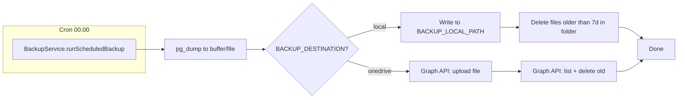

# Бекап БД в OneDrive и админка бекапов

## Режимы выгрузки

Один и тот же код поддерживает два варианта через конфиг:

| Режим        | Когда использовать                                   | Конфиг                                                                           |
| ------------ | ---------------------------------------------------- | -------------------------------------------------------------------------------- |
| **local**    | Бэкенд на твоём ПК/ноутбуке с установленным OneDrive | `BACKUP_DESTINATION=local`, `BACKUP_LOCAL_PATH=/path/to/OneDrive/Backups/tg-app` |
| **onedrive** | Бэкенд на VPS или без папки OneDrive                 | `BACKUP_DESTINATION=onedrive`, переменные Azure/Graph (см. ниже)                 |

- Ежедневный бекап в 00:00 (cron) пишет в выбранное место.
- Ротация: хранить только последние 7 дней — при каждом бекапе удалять файлы старше 7 дней (в папке или в OneDrive через API).
- Экстренный бекап и восстановление работают в обоих режимах (для restore файл загружается с фронта).

---

## 1. Backend: модуль бекапов

**Структура:** новый модуль `backend/src/backup/` (service, controller, module).

**Зависимости:**

- [@nestjs/schedule](https://docs.nestjs.com/techniques/task-scheduling) — cron «0 0 * * *» (полночь по времени сервера; при необходимости TZ через `BACKUP_TZ`).
- Для режима `onedrive`: HTTP-клиент (axios или fetch) для Microsoft Graph (refresh token → access token, PUT загрузка, GET children + DELETE для очистки старых).

**Конфиг (.env):**

- `BACKUP_DESTINATION` — `local` | `onedrive`
- `BACKUP_LOCAL_PATH` — путь к папке (для `local`; на Windows: `C:\Users\...\OneDrive\...`)
- Для `onedrive`: `ONEDRIVE_CLIENT_ID`, `ONEDRIVE_CLIENT_SECRET`, `ONEDRIVE_REFRESH_TOKEN` (получить один раз через OAuth2 flow и положить в .env)
- Опционально: `BACKUP_TZ=Europe/Kyiv` для времени крона

**Формат файла:** `pg_dump` в plain SQL (удобно для ручного просмотра и restore). Имя: например `tgapp_YYYY-MM-DD_HH-mm.sql` (для экстренного — с временем).

**Выполнение dump:**

- Если БД в Docker ([docker-compose.yml](docker-compose.yml): `docker exec tg-app-postgres pg_dump -U tgapp tgapp` — вывод в буфер/временный файл, затем отдать в выбранное место (локальная папка или Graph API).
- Если БД на хосте: вызывать `pg_dump` с параметрами из [database.config.ts](backend/src/shared/database.config.ts) (host, port, user, password, dbname). В обоих случаях — через `child_process.spawn`/`exec` с таймаутом и проверкой кода возврата.

**Ротация (7 дней):**

- **local:** при каждом бекапе сканировать `BACKUP_LOCAL_PATH`, удалять файлы с датой в имени старше 7 дней.
- **onedrive:** GET `https://graph.microsoft.com/v1.0/me/drive/root:/Backups/tg-app:/children`, по списку удалять элементы старше 7 дней (по имени или `lastModifiedDateTime`).

---

## 2. API эндпоинты (только для admin)

Все под [JwtAuthGuard](backend/src/auth/guards/jwt-auth.guard.ts) + [MasterOrAdminGuard](backend/src/auth/guards/master-or-admin.guard.ts).

- **POST `/backup/run**` — «Экстренный бекап»: выполнить dump сейчас и сохранить в то же место (local или OneDrive), вернуть имя файла и размер/статус.
- **POST `/backup/restore**` — multipart: принять файл (`.sql`), сохранить во временный файл, выполнить `psql ... < file` (через docker exec или локальный `psql`), затем удалить временный файл. Ответ — успех/ошибка. Важно: предупреждение в UI, что restore перезаписывает БД.

Для multipart в NestJS: `FileInterceptor('file')`, `@UploadedFile()` и лимит размера (например 50 MB). Проверка расширения `.sql` по имени файла.

---

## 3. Frontend: админка бекапов

- **Пункт в меню админа:** в [Dashboard.vue](frontend/src/views/Dashboard.vue) в `adminNavItems` добавить пункт «Бекапы» → `/admin/backups`.
- **Роут:** в [router/index.js](frontend/src/router/index.js) добавить маршрут с `meta: { requiresAuth: true, requiresMaster: true }`, компонент — новая страница `views/admin/Backups.vue`.
- **Страница Backups.vue:**
  - Кнопка **«Экстренный бекап»**: по нажатию `POST /backup/run`, показать индикатор загрузки и результат (успех + имя файла или ошибка).
  - Блок **«Восстановить из файла»**: input type file (accept `.sql`), кнопка «Восстановить». Перед отправкой — confirm с текстом вроде «Текущая БД будет заменена. Продолжить?». Отправка `POST /backup/restore` с FormData (поле `file`), отображение прогресса и результата.

Запросы через существующий [api/client.js](frontend/src/api/client.js): для restore использовать `fetch` с FormData и теми же auth-заголовками (без JSON body).

---

## 4. OneDrive (режим onedrive) — детали

- **Папка в OneDrive:** например `Backups/tg-app/` (создавать при первом upload через API при необходимости).
- **Токен:** один раз выполнить OAuth2 (authorization code flow), получить `refresh_token` и сохранить в `.env`. В коде при каждом запросе к Graph обновлять access token по refresh_token.
- **Загрузка:** PUT `https://graph.microsoft.com/v1.0/me/drive/root:/Backups/tg-app/{filename}:/content` с телом — содержимое dump.
- **Список и удаление:** GET children папки, для каждого файла проверить дату (из имени или `lastModifiedDateTime`), DELETE по `driveItem.id` для старых.

Документация и примеры: [DriveItem Put Content](https://learn.microsoft.com/en-us/graph/api/driveitem-put-content), [List children](https://learn.microsoft.com/en-us/graph/api/driveitem-list-children).

---

## 5. Порядок внедрения

1. Добавить в backend `@nestjs/schedule`, создать `BackupModule`, `BackupService` (логика dump, local/onedrive, ротация 7 дней), `BackupController` (run, restore).
2. Реализовать режим **local** и крон на 00:00; проверить экстренный бекап и restore.
3. Реализовать режим **onedrive** (Graph: токены, upload, list, delete).
4. Обновить `.env.example` всеми переменными бекапа.
5. Frontend: пункт меню, роут, страница Backups.vue с кнопками и загрузкой файла для restore.

---

## Диаграмма потока (ежедневный бекап)

---

## Безопасность и ограничения

- Все эндпоинты бекапа доступны только master/admin.
- Restore выполнять только после явного подтверждения в UI.
- В production не хранить пароль БД в командной строке: использовать переменные окружения или `.pgpass` при вызове `pg_dump`/`psql` (через env или конфиг сервиса).

