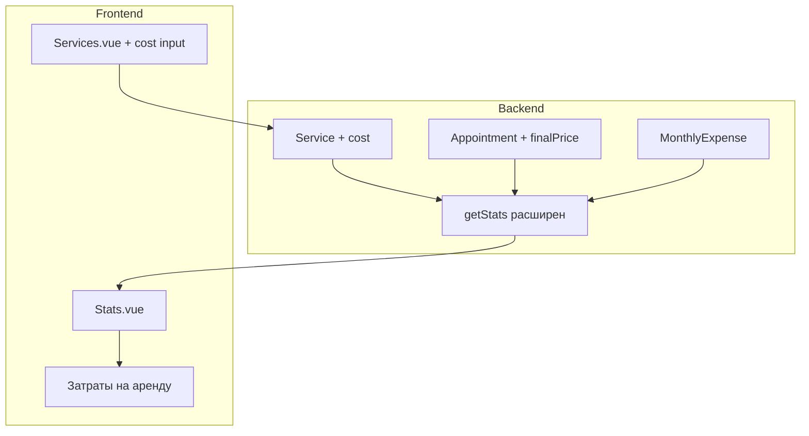

# План: Статистика заработка и затрат

## Текущее состояние

- **Stats.vue**: показывает только `totalAppointments`, `totalClients`, `byService` (количество записей по сервисам)
- **Service entity**: есть `price`, нет поля себестоимости
- **Appointment entity**: есть `finalPrice` (финальная сумма) — уже используется в [AppointmentDetail.vue](frontend/src/views/admin/AppointmentDetail.vue) для записей «по референсу»
- **Логика дохода**: сумма за запись = `finalPrice` (если указана) иначе `service.price`, иначе 0. Учитывать только записи со статусом `done`.

## Архитектура




## 1. Backend: себестоимость услуги (Service)

**Файл:** [backend/src/crm/entities/service.entity.ts](backend/src/crm/entities/service.entity.ts)

- Добавить поле `cost?: number` (decimal, nullable) — себестоимость за одну услугу

**Файлы:** [create-service.dto.ts](backend/src/crm/dto/create-service.dto.ts), [update-service.dto.ts](backend/src/crm/dto/update-service.dto.ts)

- Добавить опциональное поле `cost` (number, min 0)

**Сервис:** [crm.service.ts](backend/src/crm/crm.service.ts) — `createService`/`updateService` уже пробрасывают DTO, изменения минимальны.

---

## 2. Backend: затраты на аренду и прочее (MonthlyExpense)

**Новая сущность:** `backend/src/crm/entities/monthly-expense.entity.ts`

- `id` (uuid)
- `masterId` (varchar, FK → users)
- `yearMonth` (varchar, формат "YYYY-MM")
- `amount` (decimal) — сумма на аренду и прочее
- `createdAt`, `updatedAt`

**DTO и эндпоинты:**

- `CreateMonthlyExpenseDto` / `UpdateMonthlyExpenseDto`: `yearMonth`, `amount`
- `GET /crm/expenses?yearMonth=YYYY-MM` — получить/список расходов (по мастеру)
- `PUT /crm/expenses/:yearMonth` — создать или обновить расход за месяц (upsert по `masterId` + `yearMonth`)

**Регистрация:** CRM module, repository, controller, service.

---

## 3. Backend: расширение getStats

**Файл:** [backend/src/crm/crm.service.ts](backend/src/crm/crm.service.ts)

Расширить `getStats`:

- Добавить параметры `year` и/или `month` (опционально) для фильтрации по периоду
- Группировать записи по месяцам (по полю `date`)
- Для каждой записи со статусом `done`:
  - доход = `finalPrice ?? service.price ?? 0`
  - себестоимость = `service.cost ?? 0` (если есть service)
- Суммировать по месяцам: `revenue`, `cost`, `profitBeforeExpenses`
- Подтянуть `monthlyExpenses` за соответствующие месяцы
- Итог: `profit = revenue - cost - monthlyExpense`

**Формат ответа (дополнительно к текущему):**

```typescript
{
  // существующие поля
  totalAppointments, totalClients, byService,
  // новые
  byMonth: [
    { yearMonth: "2025-02", revenue, cost, monthlyExpense, profit, appointmentCount }
  ],
  totals: { revenue, cost, monthlyExpenses, profit }
}
```

---

## 4. Frontend: себестоимость в услугах

**Файл:** [frontend/src/views/admin/Services.vue](frontend/src/views/admin/Services.vue)

- В форму добавления услуги: опциональное поле «Себестоимость (€)»
- В списке услуг: отображать себестоимость, если указана
- При `toggleForModels` не трогать cost — это отдельное поле. Форма «Добавить» не содержит редактирования; при необходимости можно добавить отдельный режим редактирования или модалку. Минимально — только при создании и при отдельном редактировании (если будет).

Уточнение: в текущем UI услуги редактируются только через «Для моделей» toggle. Нужно добавить возможность редактирования услуги (в т.ч. cost). Самый простой вариант — кнопка «Редактировать» и модалка/форма с полями name, duration, price, cost, forModels.

---

## 5. Frontend: статистика с заработком и затратами

**Файл:** [frontend/src/views/admin/Stats.vue](frontend/src/views/admin/Stats.vue)

- Секция «Заработок по месяцам»: таблица/карточки с `yearMonth`, `revenue`, `cost`, `monthlyExpense`, `profit`
- Кнопка «Затраты на аренду и прочее» — открывает форму для ввода суммы за выбранный месяц
- Запрос к API: `GET /crm/stats` (с опциональными query `year`, `month` если нужно)
- Форма затрат: выбор месяца (YYYY-MM), поле суммы, сохранение через `PUT /crm/expenses/:yearMonth`

---

## 6. Уточнение по finalPrice

Сейчас `finalPrice` редактируется только для записей «по референсу» (`isByReference`). Для корректного подсчета заработка можно:

- **Вариант A:** Разрешить указывать `finalPrice` для любой записи (убрать условие `isByReference` в блоке финальной цены в AppointmentDetail).
- **Вариант B:** Оставить как есть; для обычных записей доход считается по `service.price`.

Рекомендация: **Вариант A** — мастер может указать фактическую сумму для любой записи, что повысит точность статистики.

---

## Порядок реализации

1. Backend: поле `cost` в Service (entity, DTO, синхронизация БД)
2. Backend: сущность MonthlyExpense, CRUD, эндпоинты
3. Backend: расширение `getStats` — по месяцам, доход/себестоимость/прибыль
4. Frontend: форма услуг — поле себестоимости + возможность редактирования услуги
5. Frontend: Stats — блок заработка по месяцам, кнопка и форма «Затраты на аренду»
6. Frontend (опционально): показ/редактирование `finalPrice` для всех записей в AppointmentDetail

---

## Миграции

Проект использует `synchronize: true` в dev, поэтому новые колонки и таблица создадутся автоматически. В production потребуется отдельная миграция.