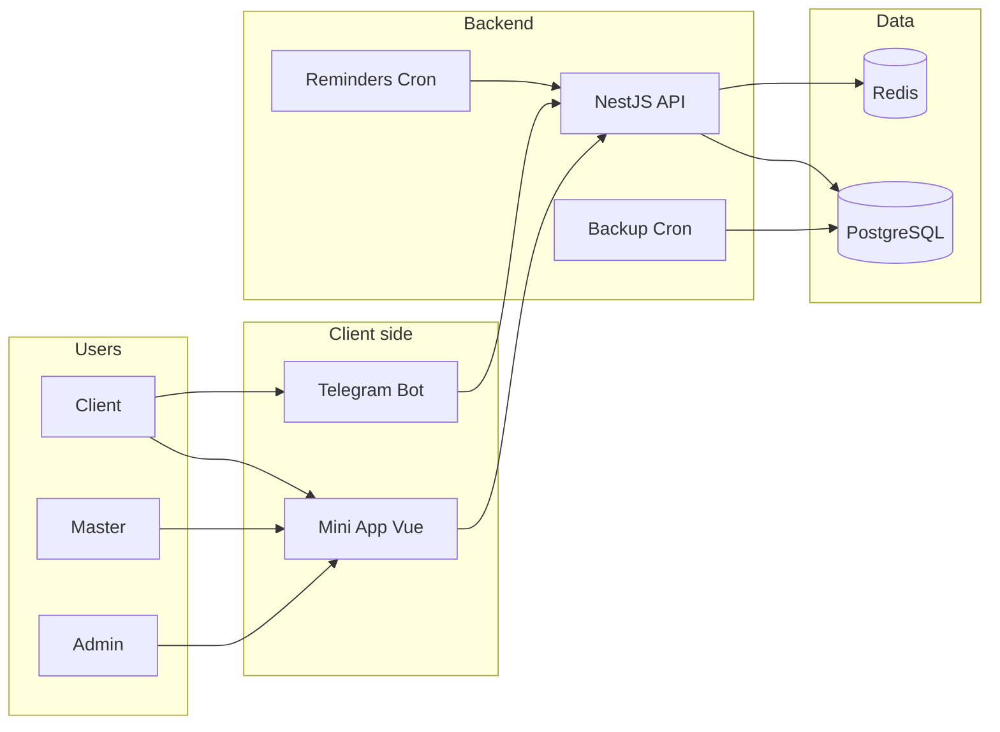
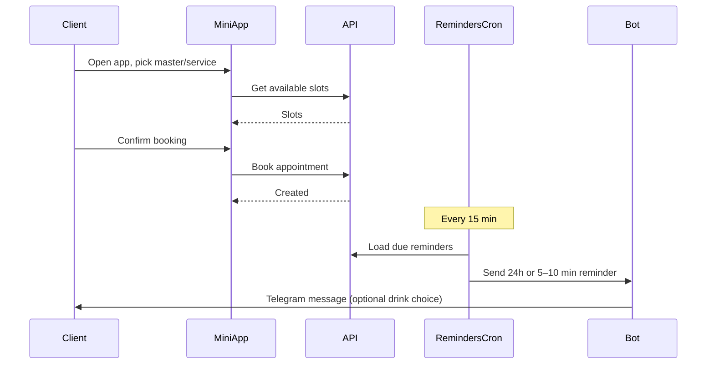
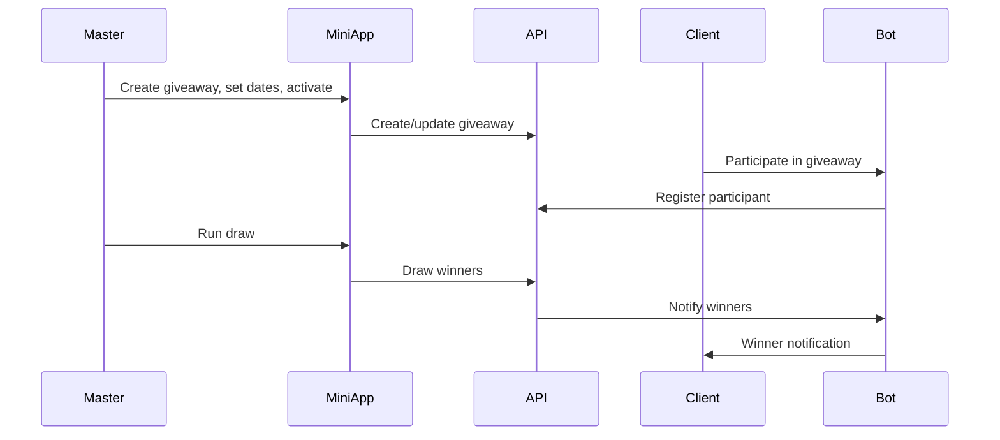
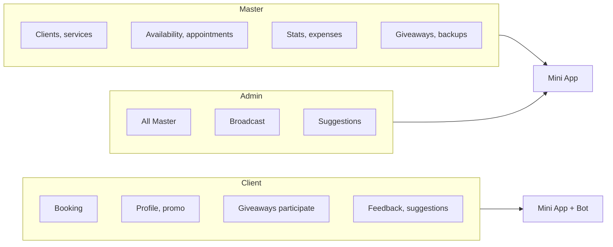

# Telegram Mini App + Bot — CRM & Booking

**CRM and booking for service pros** (salons, coaches, consultants). Clients book and get reminders in Telegram; you manage clients, schedule, giveaways, and broadcasts in one place.

- **Everything in Telegram** — no separate apps for clients.
- **Automated reminders** — 24h and 5–10 min before; re-engagement (e.g. 2–3 weeks after last visit).
- **One place** — clients, services, availability, appointments, giveaways, feedback, backups, broadcast.

**Audience:** Solo practitioners and small teams (one or few masters); admins can manage multiple masters.

**Stack:** NestJS, Vue 3, Vite, Tailwind, PostgreSQL, Redis, Telegraf, Docker.

---

## Architecture & flows

### System overview



### Booking and reminders flow



### Giveaway flow



### Roles and access



---

## Features by role

### Со стороны клиента (Mini App + Bot)

- **Запись** — выбор мастера → услуги → даты и свободного слота; подтверждение; слоты со скидкой (промо).
- **Мои записи** — просмотр предстоящих и прошедших; отмена; повторная отправка напоминания.
- **Профиль** — напиток (из опций мастера), Instagram (по желанию), **любимые дни и время** (учёт в рекомендациях слотов через 21 день).
- **Моя статистика** — сколько потрачено в сумме; разбивка по мастерам и услугам (LTV).
- **Промо** — текст промо и список слотов со скидкой.
- **Розыгрыши** — список активных/завершённых; участие через **бота** (не Mini App).
- **Предложения** — отправка предложений (категория + текст); админ меняет статус (ожидает/принято/отклонено).
- **Отзыв после визита (бот)** — оценка 1–5, комментарий и «что понравилось» (опции мастера).
- **Быстрый тест (бот)** — опрос в боте с рекомендацией курсов.
- **Напоминания** — за 24 ч и за 5–10 мин до визита; через 2–3 недели после последнего визита — напоминание с рекомендованными слотами (по любимым дням/времени или по истории).

### Со стороны мастера (Mini App)

- **Клиенты** — список с поиском (имя, ник, инстаграм, телефон) и сортировкой (по последней/первой записи, алфавиту); фильтр «все / клиенты / без заказов»; счётчики; карточка: имя, контакты, бейдж «Клиент»/«Без заказов», пропуски (noShow), LTV; детальная карточка: контакты, заметки, потрачено в сумме, разбивка по услугам, пропуски/ненадёжный, последние записи; ручное напоминание (простое и «подходящее расписание»).
- **Услуги** — CRUD.
- **Доступность** — CRUD слотов; порядок от новых дат к старым; подсветка по дате (прошлое — красный, ближайшие 3 дня — зелёный); занятые слоты полупрозрачные с именем клиента.
- **Записи** — список, фильтры, создание вручную, детали, отмена/подтверждение.
- **Статистика** — панели: всего записей, клиентов, отзывов, средний рейтинг (все кликабельные); по клику на «Всего записей» — модалка со списком записей по датам; по клику на «Клиентов» — клиенты по дате последней записи; по клику на «Отзывов» — отзывы по датам (кто, услуга, оценка, текст). Заработок по месяцам, фильтр по месяцу; новые пользователи/новые клиенты (pie chart); записи по сервисам (bar chart); доход, себестоимость, аренда, прибыль.
- **Расходы** — месячные расходы (год–месяц, сумма).
- **Розыгрыши** — создание, даты, активация, розыгрыш, уведомление победителей (бот).
- **Запросы своего времени** — клиенты запрашивают время; мастер принимает/отклоняет (доплата); создание записи из принятого запроса.
- **Напитки** — опции напитков в напоминаниях и профиле клиента.
- **Опции отзывов** — «что понравилось» для отзыва после визита.
- **Бэкапы** — запуск, восстановление; OneDrive / email; хранение 7 дней.
- **Уведомления в Telegram (бот)** — новая запись / отмена с кликабельным тегом клиента; при noShow > 0 — предупреждение в уведомлении о новой записи; после окончания времени приёма — вопрос «Завершили приём?» (Да / Нет → Перенос / Отменено / Клиент не пришёл).

### Со стороны админа (Mini App)

- Всё, что у мастера, плюс:
- **Список пользователей** — все зарегистрированные; фильтр по роли (все / админы / мастера); поиск и сортировка; переключение ролей (мастер/админ).
- **Клиенты по мастеру** — выбор мастера → тот же функционал, что у мастера (поиск, сортировка, счётчики, LTV, noShow).
- **Статистика по мастеру** — выбор мастера → та же статистика с модалками.
- **Рассылка (Broadcast)** — отправка сообщения всем пользователям в Telegram.
- **Предложения** — список и смена статуса (ожидает/принято/отклонено).

### Сводка по ролям

| Роль     | Mini App | Bot |
|----------|----------|-----|
| **Клиент** | Запись, профиль (в т.ч. любимые дни/время, статистика LTV), промо, список розыгрышей, предложения | Участие в розыгрышах, отзыв после визита, быстрый тест, напоминания |
| **Мастер** | Клиенты (поиск, сортировка, LTV, noShow), услуги, доступность, записи, статистика (с модалками), расходы, розыгрыши, своё время, напитки, опции отзывов, бэкапы | Уведомления о записях/отменах, post-session «Завершили приём?» |
| **Админ** | Всё у мастера + список пользователей и роли, клиенты по мастеру, рассылка, управление предложениями | — |

---

## Quick start

1. **Requirements:** Node.js, Docker, [Telegram Bot Token](https://t.me/BotFather).
2. **Backend:** Copy `backend/.env.example` to `backend/.env`, set `TELEGRAM_BOT_TOKEN`, `MINI_APP_URL`, `JWT_SECRET`, and DB/backup vars.
3. **Run:** `docker-compose up -d` (PostgreSQL + Redis), then start backend and frontend:

   ```bash
   cd backend && npm install && npm run start:dev
   cd frontend && npm install && npm run dev
   ```

4. Open the Mini App via your bot’s menu button (set `MINI_APP_URL` to your frontend URL, e.g. ngrok for local).

See [backend/README.md](backend/README.md) and [frontend/README.md](frontend/README.md) for project-specific details.

---

## Docs

- **Full description & features** — this file.
- For technical spec, API, DB, env, and deploy: add `docs/TECHNICAL_SPEC.md` when needed.
- For a listing (e.g. sale): add `LISTING.md` or `docs/ACQUIRE_LISTING.md` when needed.