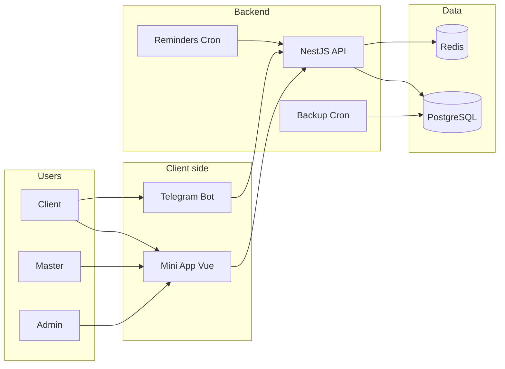
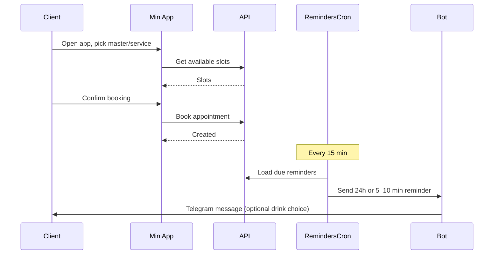
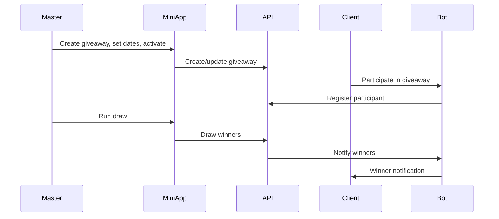
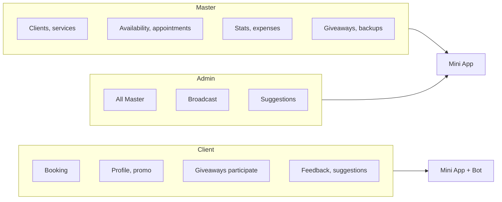

# Telegram Mini App + Bot — CRM & Booking

**CRM and booking for service pros** (salons, coaches, consultants). Clients book and get reminders in Telegram; you manage clients, schedule, giveaways, and broadcasts in one place.

- **Everything in Telegram** — no separate apps for clients.
- **Automated reminders** — 24h and 5–10 min before; re-engagement (e.g. 2–3 weeks after last visit).
- **One place** — clients, services, availability, appointments, giveaways, feedback, backups, broadcast.

**Audience:** Solo practitioners and small teams (one or few masters); admins can manage multiple masters.

**Stack:** NestJS, Vue 3, Vite, Tailwind, PostgreSQL, Redis, Telegraf, Docker.

---

## Architecture & flows

### System overview



### Booking and reminders flow



### Giveaway flow



### Roles and access



---

## Features by role

### Client (Mini App + Bot)

- **Booking** — Choose master → service → date → available slot; confirm booking; optional discount slots (promo).
- **My appointments** — View upcoming/past; cancel; request reminder resend.
- **Profile** — Set preferred drink (from master’s options), link Instagram (optional).
- **Promo** — View current promo text and list of discount slots.
- **Giveaways** — See active/ended giveaways; participate via **Telegram Bot** (not Mini App).
- **Suggestions / feedback** — Submit suggestions (category + text); admins see and set status (pending/accepted/rejected).
- **Post-session feedback (Bot)** — After visit, rate and optionally comment / select “what was good” (master-configurable options).
- **Quick test (Bot)** — In-bot quick test flow (e.g. questionnaire with suggested courses).
- **Re-engagement** — Receive “it’s been 2–3 weeks since your last visit” reminders with suggested slots.

### Master / Admin (Mini App)

- **Clients** — CRUD; notes; master-only nickname; Instagram; send manual reminder; view history.
- **Services** — CRUD for services.
- **Availability** — CRUD for availability slots (recurring or one-off).
- **Appointments** — List/filter; confirm/cancel; create manually; view detail; link to client.
- **Stats** — Dashboard (e.g. revenue, visits).
- **Expenses** — Monthly expenses per master (year-month, amount).
- **Giveaways** — Create (draft → set dates → activate); run draw; verify participants (Bot); notify winners (Bot).
- **Custom time requests** — Clients request specific times; master accepts/declines (optional fee); optionally create appointment from accepted request.
- **Suggestions** — List; update status (pending/accepted/rejected). *Admin only for management.*
- **Drinks** — Configure drink options shown in reminders and client profile.
- **Feedback options** — Configure “what was good” options for post-session feedback.
- **Backups** — Trigger backup run; restore from file; destination: local / OneDrive / email; retention 7 days.
- **Broadcast (Admin only)** — Send message to all users (e.g. Telegram).

### Role summary

| Role   | Mini App | Bot |
|--------|----------|-----|
| **Client** | Booking, profile, promo, giveaways list, suggestions | Giveaway participation, post-session feedback, quick test, reminders |
| **Master** | Full CRM (clients, services, availability, appointments, stats, expenses, giveaways, custom time, drinks, backups) | — |
| **Admin** | Everything Master + broadcast + suggestions management; multiple masters | — |

---

## Quick start

1. **Requirements:** Node.js, Docker, [Telegram Bot Token](https://t.me/BotFather).
2. **Backend:** Copy `backend/.env.example` to `backend/.env`, set `TELEGRAM_BOT_TOKEN`, `MINI_APP_URL`, `JWT_SECRET`, and DB/backup vars.
3. **Run:** `docker-compose up -d` (PostgreSQL + Redis), then start backend and frontend:

   ```bash
   cd backend && npm install && npm run start:dev
   cd frontend && npm install && npm run dev
   ```

4. Open the Mini App via your bot’s menu button (set `MINI_APP_URL` to your frontend URL, e.g. ngrok for local).

See [backend/README.md](backend/README.md) and [frontend/README.md](frontend/README.md) for project-specific details.

---

## Docs

- **Full description & features** — this file.
- For technical spec, API, DB, env, and deploy: add `docs/TECHNICAL_SPEC.md` when needed.
- For a listing (e.g. sale): add `LISTING.md` or `docs/ACQUIRE_LISTING.md` when needed.
